<h1>CAPÍTULO III: REQUIREMENTS SPECIFICATION</h1>
<h2>3.1 To-Be Scenario Mapping</h2>

<h2>3.2 User Stories</h2>
<table>
  <thead>
    <tr>
      <th>Epic / Story ID</th>
      <th>Título</th>
      <th>Descripción</th>
      <th>Criterios de aceptación</th>
      <th>Relacionado con (Epic ID)</th>
    </tr>
  </thead>
  <tbody>
    <tr>
      <td>EP01</td>
      <td>Autenticación de usuario</td>
      <td>Como usuario Quiero registrarme e iniciar sesión Para acceder a la aplicación MyEvent</td>
      <td>El usuario puede registrar una cuenta nueva con su información personal.
          El usuario puede iniciar sesión con su nombre de usuario y contraseña.
          El usuario recibirá un mensaje de error si el inicio de sesión falla.</td>
      <td>EP01</td>
    </tr>
    <tr>
      <td>EP02</td>
      <td>Creación de eventos</td>
      <td>Como organizador de eventos Quiero poder crear y publicar eventos en la plataforma Para promover mi evento y vender entradas</td>
      <td>El organizador puede completar un formulario con detalles del evento.
          El organizador puede enviar el evento para su revisión y aprobación.
          El evento se muestra en la plataforma una vez aprobado por el administrador.</td>
      <td>EP02</td>
    </tr>
    <tr>
      <td>EP03</td>
      <td>Exploración de eventos</td>
      <td>Como usuario interesado en eventos Quiero poder buscar y filtrar eventos disponibles Para encontrar eventos que me interesen</td>
      <td>El usuario puede navegar por una lista de eventos.
          El usuario puede aplicar filtros por categorías como género musical, ubicación y fecha.
          El usuario puede ver detalles de eventos individuales haciendo clic en ellos.</td>
      <td>EP03</td>
    </tr>
    <tr>
      <td>EP04</td>
      <td>Compra de entradas</td>
      <td>Como comprador de entradas Quiero poder seleccionar y comprar entradas Para asegurar mi participación en eventos</td>
      <td>El usuario puede seleccionar las entradas deseadas y agregarlas al carrito.
          El usuario puede completar el proceso de pago utilizando diferentes métodos de pago.
          El usuario recibe confirmación de la compra por correo electrónico.</td>
      <td>EP04</td>
    </tr>
    <tr>
      <td>EP05</td>
      <td>Opción Premium para Revendedores</td>
      <td>Como revendedor Quiero tener una opción premium Para obtener ventajas sobre otros compradores</td>
      <td>El revendedor puede comprar una membresía premium con acceso anticipado y límites de compra más altos.
          El revendedor puede acceder a la opción premium desde su cuenta.
          El revendedor recibe beneficios adicionales al adquirir la membresía premium.</td>
      <td>EP05</td>
    </tr>
    <tr>
      <td>EP06</td>
      <td>Transferencia de Entradas</td>
      <td>Como usuario que ya ha comprado entradas Quiero poder transferirlas a otros usuarios Para permitir que otros disfruten del evento</td>
      <td>El usuario puede seleccionar las entradas que desea transferir.
          El usuario puede proporcionar la información de contacto del destinatario.
          El usuario recibe confirmación de la transferencia exitosa.</td>
      <td>EP06</td>
    </tr>
    <tr>
      <td>EP07</td>
      <td>Membresía de Descuentos Periódicos</td>
      <td>Como usuario fiel a la plataforma Quiero recibir descuentos especiales periódicamente Para incentivar mi participación continua</td>
      <td>El usuario puede adquirir una membresía que le otorgue descuentos periódicos en eventos seleccionados.
          El usuario recibe notificaciones sobre los descuentos disponibles.
          El usuario puede aplicar los descuentos durante el proceso de compra.</td>
      <td>EP07</td>
    </tr>
        <tr>
      <td>EP08</td>
      <td>Membresía de Concursos y Sorteos Exclusivos</td>
      <td>Como miembro de la plataforma, quiero participar en concursos y sorteos exclusivos para ganar entradas gratuitas y experiencias VIP, para disfrutar de beneficios adicionales y experiencias únicas.</td>
      <td>El usuario puede acceder a concursos y sorteos exclusivos desde su cuenta.
          El usuario puede participar en los concursos y sorteos siguiendo las instrucciones proporcionadas.
          El usuario recibe notificaciones sobre los resultados de los concursos y sorteos.</td>
      <td>EP08</td>
    </tr>
    <tr>
      <td>EP09</td>
      <td>Membresía de Contenido Exclusivo</td>
      <td>Como suscriptor premium, quiero tener acceso a contenido exclusivo relacionado con eventos, como transmisiones en vivo y entrevistas detrás de escena, para disfrutar de una experiencia más completa y enriquecedora.</td>
      <td>El usuario puede acceder a contenido exclusivo desde su cuenta premium.
          El usuario puede ver transmisiones en vivo y contenido especial disponible solo para suscriptores premium.
          El usuario puede comentar y compartir el contenido exclusivo con otros usuarios.</td>
      <td>EP09</td>
    </tr>
    <tr>
      <td>EP10</td>
      <td>Membresía de Prioridad en Servicio al Cliente</td>
      <td>Como usuario premium, quiero recibir atención prioritaria en el servicio al cliente, con tiempos de respuesta más rápidos y asistencia personalizada, para sentirme valorado y apoyado como cliente leal.  </td>
      <td>El usuario premium puede acceder a un servicio al cliente dedicado desde su cuenta.
          El usuario premium recibe respuestas más rápidas a sus consultas y solicitudes de soporte.
          El usuario premium puede comunicarse con el servicio al cliente a través de canales exclusivos, como líneas telefónicas o correos electrónicos dedicados.</td>
      <td>EP10</td>
<tr>
  <td>EP11</td>
  <td>Membresía de Descuentos en Futuras Compras</td>
  <td>Como usuario habitual de la plataforma, quiero recibir descuentos para futuras compras de entradas Para incentivar mi lealtad y continuar utilizando el servicio</td>
  <td>El usuario acumula descuentos después de comprar un número determinado de entradas.
      El usuario recibe un cupón de descuento para su próxima compra después de alcanzar el umbral establecido.
      El usuario puede aplicar el cupón durante el proceso de compra.</td>
  <td>EP11</td>
</tr>
<tr>
  <td>EP12</td>
  <td>Entradas Gratis para Eventos Seleccionados</td>
  <td>Como usuario frecuente de la plataforma, quiero tener la oportunidad de obtener entradas gratuitas Para disfrutar de eventos sin costo adicional y fomentar mi fidelidad</td>
  <td>El usuario acumula entradas gratuitas después de comprar un cierto número de entradas.
      El usuario puede canjear una entrada gratuita para un evento específico de su elección.
      El usuario puede seleccionar la entrada gratuita durante el proceso de compra.</td>
  <td>EP12</td>
</tr>
<tr>
  <td>EP13</td>
  <td>Acceso a Preventas Exclusivas</td>
  <td>Como usuario frecuente de la plataforma, quiero tener acceso exclusivo a preventas de eventos populares Para asegurar mi participación en eventos de alto demanda</td>
  <td>El usuario acumula acceso a preventas exclusivas después de comprar un número determinado de entradas.
      El usuario puede comprar entradas antes de que estén disponibles para el público en general.
      El usuario puede asegurar su participación en eventos populares durante la preventa.</td>
  <td>EP13</td>
</tr>
<tr>
  <td>EP14</td>
  <td>Puntos de Fidelidad o Programa de Recompensas</td>
  <td>Como usuario frecuente de la plataforma, quiero acumular puntos de fidelidad por cada compra de entradas Para canjearlos por descuentos, entradas gratuitas u otros beneficios</td>
  <td>El usuario acumula puntos de fidelidad por cada compra de entradas.
      El usuario puede canjear los puntos por recompensas como descuentos, entradas gratis o productos exclusivos.
      El usuario puede verificar su saldo de puntos y las opciones de canje desde su cuenta.</td>
  <td>EP14</td>
</tr>
<tr>
  <td>EP15</td>
  <td>Niveles de Entrada con Descuento</td>
  <td>Como usuario frecuente de la plataforma, quiero acceder a precios especiales de entrada después de realizar cierto número de compras Para disfrutar de beneficios adicionales y promociones exclusivas</td>
  <td>El usuario alcanza niveles de entrada con descuento después de comprar un número determinado de entradas.
      El usuario puede acceder a precios especiales para ciertos niveles de entrada.
      El usuario puede seleccionar el nivel de entrada con descuento durante el proceso de compra.</td>
  <td>EP15</td>
</tr>
<tr>
  <td>EP16</td>
  <td>Notificaciones de Eventos y Ofertas</td>
  <td>Como usuario de la plataforma, quiero recibir notificaciones sobre eventos nuevos y ofertas especiales Para estar al tanto de las últimas novedades y oportunidades</td>
  <td>El usuario puede optar por recibir notificaciones por correo electrónico o mensajes push en la aplicación.
      El usuario puede configurar sus preferencias de notificación desde la cuenta.
      El usuario recibe información actualizada sobre eventos nuevos, descuentos y promociones.</td>
  <td>EP16</td>
</tr>
<tr>
  <td>EP17</td>
  <td>Integración con Redes Sociales</td>
  <td>Como usuario de la plataforma, quiero poder compartir eventos y experiencias en mis redes sociales Para ampliar el alcance de la plataforma y compartir intereses con amigos</td>
  <td>El usuario puede conectar su cuenta de la plataforma con redes sociales como Facebook, Twitter o Instagram.
      El usuario puede compartir detalles de eventos, compras de entradas y experiencias directamente desde la plataforma.
      Los amigos y seguidores del usuario pueden ver y participar en eventos compartidos.</td>
  <td>EP17</td>
</tr>
<tr>
  <td>EP18</td>
  <td>Soporte Multilingüe</td>
  <td>Como usuario de la plataforma, quiero poder acceder a la aplicación en varios idiomas Para facilitar la navegación y comprensión del contenido</td>
  <td>El usuario puede seleccionar su idioma preferido desde la configuración de la cuenta.
      La aplicación se traduce automáticamente al idioma seleccionado por el usuario.
      Todos los textos, botones y mensajes de la aplicación están disponibles en el idioma elegido.</td>
  <td>EP18</td>
</tr>
<tr>
  <td>EP19</td>
  <td>Integración con Mapas y Direcciones</td>
  <td>Como usuario de la plataforma, quiero tener acceso a información de ubicación y direcciones de eventos Para facilitar la planificación y asistencia a los mismos</td>
  <td>El usuario puede ver la ubicación del evento en un mapa interactivo.
      El usuario puede obtener direcciones y rutas recomendadas hacia el lugar del evento.
      La aplicación muestra información detallada sobre la ubicación, incluyendo transporte público cercano y estacionamientos.</td>
  <td>EP19</td>
</tr>
<tr>
  <td>EP20</td>
  <td>Calificación y Reseñas de Eventos</td>
  <td>Como usuario de la plataforma, quiero poder calificar y dejar reseñas sobre eventos a los que asistí Para compartir experiencias y ayudar a otros usuarios en su decisión de compra</td>
  <td>El usuario puede calificar eventos utilizando una escala de estrellas.
      El usuario puede escribir reseñas detalladas sobre su experiencia en el evento.
      Las calificaciones y reseñas están visibles para otros usuarios interesados en el evento.</td>
  <td>EP20</td>
</tr>
<tr>
  <td>EP21</td>
  <td>Asistencia en Vivo y Chat en Línea</td>
  <td>Como usuario de la plataforma, quiero tener acceso a asistencia en vivo y chat en línea Para resolver consultas rápidamente y recibir ayuda durante la navegación</td>
  <td>El usuario puede acceder a un servicio de chat en vivo desde la aplicación.
      El usuario puede recibir respuestas rápidas a preguntas sobre eventos, compras de entradas y problemas técnicos.
      La asistencia en vivo está disponible durante horas específicas y es accesible desde cualquier página de la aplicación.</td>
  <td>EP21</td>
</tr>
<tr>
  <td>EP22</td>
  <td>Estadísticas y Análisis de Participación</td>
  <td>Como organizador de eventos, quiero acceder a estadísticas y análisis detallados sobre la participación en mis eventos Para evaluar su éxito y mejorar la planificación futura</td>
  <td>El organizador puede ver datos de participación, incluyendo número de entradas vendidas y perfiles de compradores.
      El organizador puede acceder a informes analíticos sobre la satisfacción de los asistentes y la efectividad de las estrategias de marketing.
      Las estadísticas están disponibles en tiempo real y se presentan de manera clara y comprensible.</td>
  <td>EP22</td>
</tr>
<tr>
  <td>EP23</td>
  <td>Integración con Plataformas de Streaming</td>
  <td>Como usuario de la plataforma, quiero tener acceso a transmisiones en vivo y contenido exclusivo de eventos Para disfrutar de experiencias virtuales y ampliar mi participación en eventos</td>
  <td>El usuario puede acceder a transmisiones en vivo de eventos a través de la plataforma.
      El usuario puede ver contenido exclusivo relacionado con eventos como entrevistas, sesiones acústicas y contenido detrás de escena.
      La plataforma integra servicios de streaming populares para ofrecer una experiencia inmersiva a los usuarios.</td>
  <td>EP23</td>
</tr>
<tr>
  <td>EP24</td>
  <td>Verificación de Identidad para Revendedores</td>
  <td>Como revendedor de entradas, quiero completar un proceso de verificación de identidad Para garantizar la legitimidad de mis transacciones y proteger la integridad de la plataforma</td>
  <td>El revendedor proporciona información de identificación oficial, como documento de identidad o pasaporte.
      La plataforma verifica la identidad del revendedor antes de habilitar funciones avanzadas como la compra anticipada y límites de compra más altos.
      La verificación de identidad se realiza de manera segura y confidencial, cumpliendo con las regulaciones de protección de datos.</td>
  <td>EP24</td>
</tr>
<tr>
  <td>EP25</td>
  <td>Integración con Plataformas de Pago Internacionales</td>
  <td>Como usuario internacional de la plataforma, quiero poder utilizar diferentes métodos de pago Para facilitar la compra de entradas desde cualquier parte del mundo</td>
  <td>El usuario puede seleccionar su método de pago preferido entre una variedad de opciones internacionales.
      La plataforma integra pasarelas de pago seguras y confiables que admiten tarjetas de crédito, transferencias bancarias y monederos electrónicos.
      Los pagos se procesan en la moneda local del usuario, simplificando las transacciones internacionales.</td>
  <td>EP25</td>
</tr>
<tr>
  <td>EP26</td>
  <td>Reserva de Entradas</td>
  <td>Como usuario de la plataforma, quiero tener la opción de reservar entradas para eventos populares Para garantizar mi participación antes de la venta general</td>
  <td>El usuario puede realizar una reserva para asegurar entradas antes de que estén disponibles para la venta general.
      La reserva se confirma mediante un pago inicial que se deduce del precio total de las entradas.
      El usuario recibe instrucciones claras sobre el proceso de reserva y los plazos de pago.</td>
  <td>EP26</td>
</tr>
<tr>
  <td>EP27</td>
  <td>Reembolso y Política de Devoluciones</td>
  <td>Como usuario de la plataforma, quiero conocer la política de reembolso y devoluciones Para tomar decisiones informadas sobre mis compras de entradas</td>
  <td>La plataforma proporciona información clara sobre las condiciones de reembolso y devoluciones.
      El usuario puede solicitar un reembolso dentro de ciertos plazos y bajo ciertas condiciones especificadas.
      La política de reembolso y devoluciones se comunica de manera transparente para garantizar la satisfacción del cliente.</td>
  <td>EP27</td>
</tr>

</tr>
  </tbody>
</table>

<h2>3.3 Impact Mapping</h2>
  

<h2>3.4 Product Backlog</h2>
<table>
  <thead>
    <tr>
      <th># Orden</th>
      <th>User Story ID</th>
      <th>Título</th>
      <th>Descripción</th>
      <th>Story Points</th>
    </tr>
  </thead>
  <tbody>
    <tr>
      <td>1</td>
      <td>EP01</td>
      <td>Autenticación de usuario</td>
      <td>Como usuario quiero registrarme e iniciar sesión Para acceder a MyEvent</td>
      <td>3</td>
    </tr>
    <tr>
      <td>2</td>
      <td>EP02</td>
      <td>Creación de eventos</td>
      <td>Como organizador de eventos Quiero poder crear y publicar eventos en la plataforma Para promover mi evento y vender entradas</td>
      <td>5</td>
    </tr>
    <tr>
      <td>3</td>
      <td>EP03</td>
      <td>Exploración de eventos</td>
      <td>Como usuario interesado en eventos Quiero poder buscar y filtrar eventos disponibles Para encontrar eventos que me interesen</td>
      <td>3</td>
    </tr>
    <tr>
      <td>4</td>
      <td>EP04</td>
      <td>Compra de entradas</td>
      <td>Como comprador de entradas Quiero poder seleccionar y comprar entradas Para asegurar mi participación en eventos</td>
      <td>8</td>
    </tr>
    <tr>
      <td>5</td>
      <td>EP05</td>
      <td>Opción Premium para Revendedores</td>
      <td>Como revendedor Quiero tener una opción premium Para obtener ventajas sobre otros compradores</td>
      <td>5</td>
    </tr>
    <tr>
      <td>6</td>
      <td>EP06</td>
      <td>Transferencia de Entradas</td>
      <td>Como usuario que ya ha comprado entradas Quiero poder transferirlas a otros usuarios Para permitir que otros disfruten del evento</td>
      <td>3</td>
    </tr>
    <tr>
      <td>7</td>
      <td>EP07</td>
      <td>Membresía de Descuentos Periódicos</td>
      <td>Como usuario fiel a la plataforma Quiero recibir descuentos especiales periódicamente Para incentivar mi participación continua</td>
      <td>2</td>
    </tr>
    <tr>
      <td>8</td>
      <td>EP08</td>
      <td>Membresía de Concursos y Sorteos Exclusivos</td>
      <td>Como miembro de la plataforma, quiero participar en concursos y sorteos exclusivos para ganar entradas gratuitas y experiencias VIP, para disfrutar de beneficios adicionales y experiencias únicas.</td>
      <td>3</td>
    </tr>
    <tr>
      <td>9</td>
      <td>EP09</td>
      <td>Membresía de Contenido Exclusivo</td>
      <td>Como suscriptor premium, quiero tener acceso a contenido exclusivo relacionado con eventos, como transmisiones en vivo y entrevistas detrás de escena, para disfrutar de una experiencia más completa y enriquecedora.</td>
      <td>5</td>
    </tr>
    <tr>
      <td>10</td>
      <td>EP10</td>
      <td>Membresía de Prioridad en Servicio al Cliente</td>
      <td>Como usuario premium, quiero recibir atención prioritaria en el servicio al cliente, con tiempos de respuesta más rápidos y asistencia personalizada, para sentirme valorado y apoyado como cliente leal.</td>
      <td>3</td>
    </tr>
  </tbody>
</table>

    
<h1>CAPÍTULO IV: PRODUCT UX/UI DESIGN</h1>
<h2>4.1 Style Guidelines</h2>
<h3>4.1.1 General Style Guidelines</h3>
<h3>4.1.2 Web Style Guidelines</h3>

<h2>4.2 Information Architecture</h2>
<h3>4.2.1 Organization Systems</h3>

En este apartado, nuestro equipo ha optado por implementar un enfoque basado en la jerarquía visual. Creemos firmemente que esta estructura organizativa proporcionará una experiencia más intuitiva y eficiente para nuestros usuarios, al tiempo que les permitirá interactuar de manera más fluida con nuestra aplicación.

<h3>4.2.2 Labeling Systems</h3>

Para el diseño de nuestra página web, hemos implementado un sistema de etiquetado uniforme con el objetivo de facilitar la navegación de los usuarios por nuestra plataforma. Este sistema se compone de etiquetas específicas que tienen funciones definidas para mejorar la experiencia del usuario. A continuación, se detallan las etiquetas utilizadas:

<ul>
  <li><strong>Inicio:</strong> Dirige a la página de inicio.</li>
  <li><strong>MyEvent:</strong> Acceso al área de eventos disponibles.</li>
  <li><strong>Nosotros:</strong> Información sobre nuestra empresa.</li>
  <li><strong>Contáctanos:</strong> Canal para comunicarse con nuestro equipo de soporte.</li>
</ul>

<ul>
  <li><strong>Discotecas:</strong> Eventos relacionados con establecimientos sociales y clubes.</li>
  <li><strong>Conciertos:</strong> Eventos musicales en vivo.</li>
  <li><strong>Eventos:</strong> Otras actividades y espectáculos disponibles.</li>
</ul>

<h3>4.2.3 SEO Tags and Meta Tags</h3>
<h3>4.2.4 Searching Systems</h3>

Los sistemas de búsqueda son esenciales para permitir a los usuarios encontrar y descubrir características y funcionalidades relevantes en nuestro sitio web. Para una experiencia de usuario eficiente, hemos implementado un sistema de búsqueda simple pero efectivo:

<ul>
  <li><strong>Lupa de Búsqueda:</strong> Permite a los usuarios buscar rápidamente cualquier tema de su interés.</li>
  <li><strong>Perfil de Usuario:</strong> Representado por el icono del usuario, proporciona acceso al perfil del usuario para editar información o iniciar sesión.</li>
  <li><strong>Membresías:</strong> Representado por el icono de membresías, muestra los planes disponibles y sus precios para suscripciones mensuales o anuales.</li>
</ul>

<h3>4.2.5 Navigation Systems</h3>

Nuestra aplicación cuenta con un sistema de navegación claro y definido para garantizar una experiencia fluida para los usuarios.

El sistema de navegación de nuestra aplicación móvil está diseñado para ofrecer a los usuarios una experiencia intuitiva y fluida. Con iconos claramente identificados en la parte superior, los usuarios pueden acceder fácilmente a las funciones principales de la aplicación.

<h2>4.3 Landing Page UI Design</h2>
<h3>4.3.1 Landing Page Wireframe</h3>
<td>Desktop Landing Page Wireframe:</td>
 
<td>Pantalla de inicio, contiene el apartado mas llamativo del landing page.</td>

 
<td>Pantalla de "Proximos eventos", este apartado contiene los diversos eventos a los que pueden asistir los usuarios.</td>

 
<td>Pantalla de "Nosotros", este apartado contiene la mision de la startup, junto con el proposito de la plataforma web.</td>

 
<td>Pantalla de "Contactanos", en este apartado encuentran la informacion de contacto del startup.</td>

 

Link de la entrevista: https://www.figma.com/file/dDsv9BCQHxxzDUz3hqTTyp/Landing-Page-Wireframe--Desarrollo-Open-Source?type=design&mode=design&t=baNvdMOlwkRcVvBE-1

<h3>4.3.2 Landing Page Mock-up</h3>
 
<td>Pantalla de inicio, contiene el apartado mas llamativo del landing page con los colores asignados en el Style Guidelines, detalla brevemente las multiples opciones que puede tener el usuario, acompañado con imagenes referentes.</td>

 
<td>Pantalla de "Proximos eventos", este apartado contiene los diversos eventos a los que el usuario puede asistir, incluye la foto del artista o artistas, el lugar y la fecha de preentación.</td>

 
<td>Pantalla de "Nosotros", este apartado contiene la mision de la startup y muestra el lineamiento que sigue la paltaforma web para cunmplir su proposito.</td>

 
<td>Pantalla de "Contactanos", en este apartado encuentran la informacion de contacto del startup. Insertamos un QR Code para facilitar el medio de comunicacion entre el usuario y nosotros. </td>

 
<h2>4.4 Web Applications UX/UI Design</h2>
<h3>4.4.1 Web Applications Wireframes</h3>
<h3>4.4.2 Web Applications Wireflow Diagrams</h3>
<h3>4.4.2 Web Applications Mock-ups</h3>
<h3>4.4.3 Web Applications User Flow Diagrams</h3>

<h2>4.5 Web Applications Prototyping</h2>

<h2>4.6 Domain-Driven Software Architecture</h2>
<h3>4.6.1 Software Architecture Context Diagram</h3>

<h3>4.6.2 Software Architecture Container Diagrams</h3>

<h3>4.6.3 Software Architecture Components Diagrams</h3>
<h4>Landing Page</h4>

<h4>Web Application</h4>

<h4>Mobile Application</h4>

<h4>API</h4>

<h2>4.7 Software Object-Oriented Design</h2>
<h3>4.7.1 Class Diagrams</h3>

<h3>4.7.2 Class Dictionary</h3>

<td><strong>Usuario</strong></td>

Representa a las personas que interactuan con la aplicacion.

Los usuarios poseen:

<ul>
    <li>Nombre</li>
    <li>Apellido</li>
    <li>Dirección</li>
    <li>Correo electronico</li>
    <li>Telefono</li>
    <li>Contraseña</li>
    <li>Fecha de creacion</li>
    <li>Fecha de suspension</li>
</ul>

<td><strong>Cliente</strong></td>

Usuario que solo puede comprar y ver los eventos disponibles en el aplicativo, tiene un metodo de pago para pagar sus boletos/entradas

<td><strong>Revenvedor</strong></td>

Un cliente puede volverse un revendedor, para eso necesita registrar donde sera almacenado su dinero.

<td><strong>Organizador</strong></td>

Usuario que solo puede ofertar y administrar eventos en el aplicativo, esta ligado a una empresa.

<td><strong>Boleto</strong></td>

Posee toda la informacion de compra como el precio y datos del evento, usuario y categoria de boleto.

<td><strong>Categoria</strong></td>

Se usa para clasificar los boletos de un evento, ya se por ubicacion, calidad u otro factor. La categoria afecta el precio del boleto.

<td><strong>Evento</strong></td>

Los eventos pueden ser conciertos, obras de teatro, etc.

Los eventos poseen:

<ul>
    <li>Un nombre</li>
    <li>Descripcion que tiene la informacion del evento</li>
    <li>Periodo de tiempo de inicio y fin</li>
    <li>Una sede donde se da a cabo el evento</li>
    <li>Un organizador que es el encargado principal del evento</li>
    <li>Un total de boletos/entradas</li>
</ul>

<td><strong>Precio</strong></td>

El precio cambia segun el evento y sus categorias, toda esta informacion es registrada por el organizador.

<td><strong>Lugar</strong></td>

Es una ubicación fisica donde reside un local.

<td><strong>RUC</strong></td>

Es el padrón que contiene los datos de identificación de las actividades económicas y demás información relevante de los sujetos inscritos.

<td><strong>Sede</strong></td>

Es el lugar donde se va a dar a cabo el evento, tiene un numero de asientos limitado.

<td><strong>Empresa</strong></td>

Es el ente que financia el evento y tiene un organizador que los representa en el evento./>

<h2>4.8 Database Design</h2>
<h3>4.8.1 Database Diagram</h3>

    
<h1>CAPÍTULO V: PRODUCT IMPLEMENTATION</h1>
<h2>5.1 Software Configuration Management</h2>
<h3>5.1.1 Software Development Environment Configuration</h3>

En la siguiente sección se detalla la ruta de acceso de cada uno de los productos de software, facilitando a cualquier miembro del equipo el desarrollo de cada aspecto del trabajo:

Visual Studio Code: Entorno de desarrollo.

HTML5: Lenguaje de marcado para la elaboración de páginas web.

CSS3: Tecnología para dar estilo a nuestras páginas web.

JavaScript: Lenguaje de programación orientado a objetos utilizado para implementar funcionalidades en nuestra Landing Page.

GitHub: Repositorio colaborativo en la nube.

GitHub Pages: Plataforma que facilita implementar despliegues sencillos para nuestras páginas web.

LucidChart: Aplicación web dedicada a la elaboración de Wireflows, User Flows y diagramas de clases.

Vertabelo: Plataforma colaborativa para la creación de diagramas de base de datos.

Figma: Herramienta colaborativa que permite elaborar wireframes y mockups.

<h3>5.1.2 Source Code Management</h3>

Link del Landing Page: https://stxfxno.github.io/MyEvent/myevent.html
    

Trabajamos con tres ramas principales:
  

Main: Es nuestra rama principal donde presentaremos nuestras publicaciones oficiales.

Dev: Esta rama es nuestro entorno de desarrollo, donde probamos e integramos las funcionalidades trabajadas antes de ser implementadas en la rama principal.
    

Feat: Esta rama se descompone en ramas individuales por cada funcionalidad o feature trabajada, permitiendo un enfoque más específico y organizado en el desarrollo de cada aspecto del proyecto.

<h3>5.1.3 Source Code Style Guide & Conventions</h3>

HTML:

En HTML se aplicó la nomenclatura en inglés, por ello en cada DIV su class va estar declarado en este idioma, también podemos observar esto en los inputs y en la clase de span.

div class="search">/div

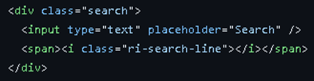

div class="destination__container">/div

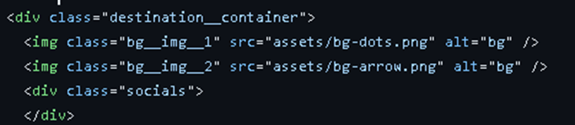

CSS:

En CSS se mantuvo el mismo trabajo de como se realizó en el HTML.
  
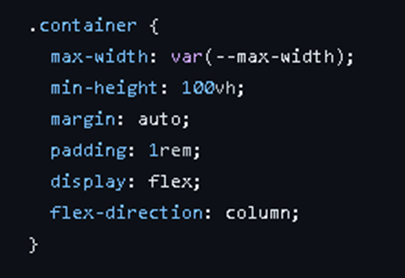
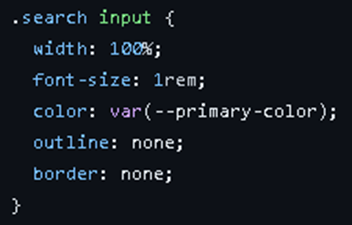

JS:

Con respecto al desarrollo del JS las variables usadas también se aplico la nomenclatura en inglés:

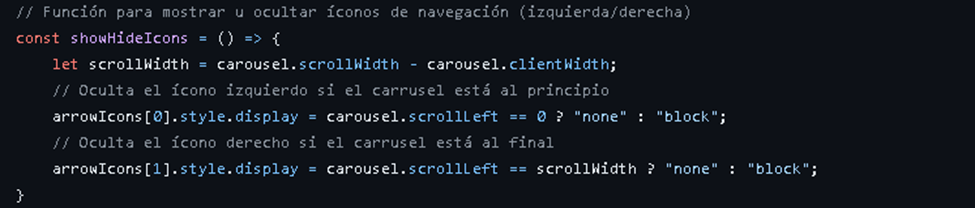

Con la primera función creada en JS de const showHideIcons se espera que cada vez que fuera a la izquierda o derecha se ocultara el icono de navegación:

Icono de la izquierda oculto:

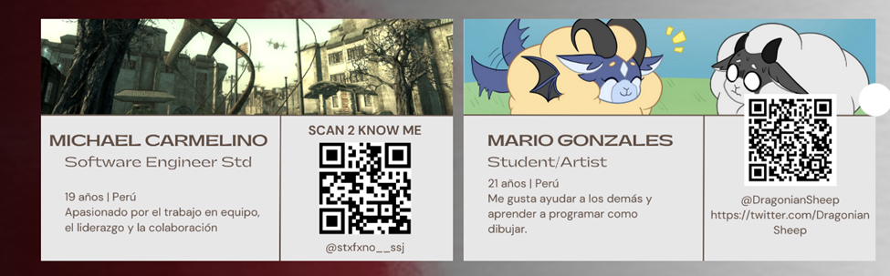

Icono de la derecha oculto:

Con respecto a la segunda función, nos da la posibilidad de navegar en el carrusel de arrastrando las imágenes de manera horizontal, ya sea para la derecha o izquierda.

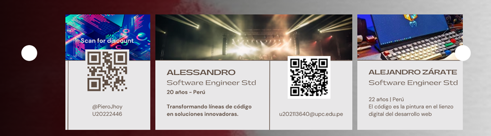
<h3>5.1.4 Software Deployment Configuration</h3>

Primero: Subimos todos los archivos necesarios para que github.pages funcione correctamente, entre ellos podemos observar el index.html, styles.css y las demás carpetas que están en formato html.

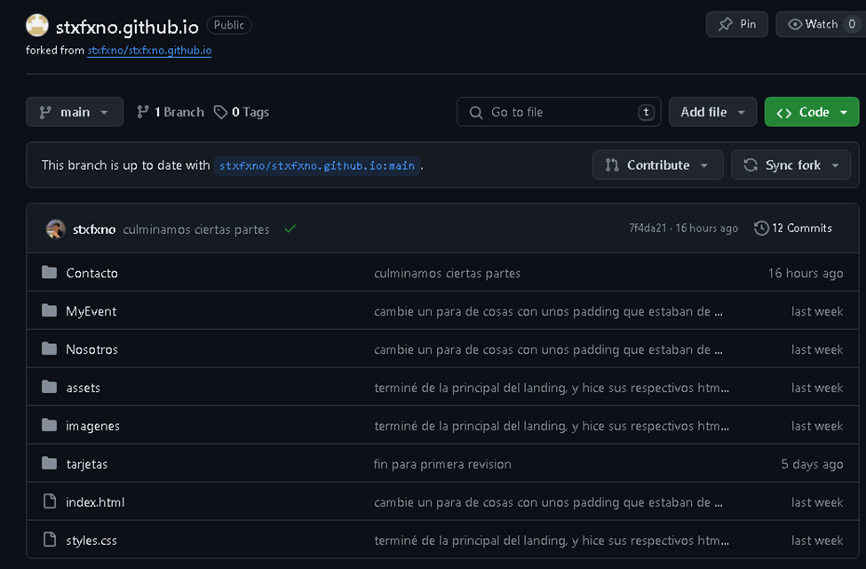

Segundo: Recordemos que para funcione la página correctamente la implementación de nuestro landing page debe de tener la siguiente nomenclatura:
  

Nombre del proyecto.github.io en este caso se uso el nombre de stxfxno para el nombre del proyecto.

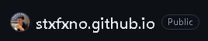

Tercero: Verificamos que la pagina se haya subido de manera correcta a GitHub Pages , por ello entramos a settings y vamos al apartado de page. 

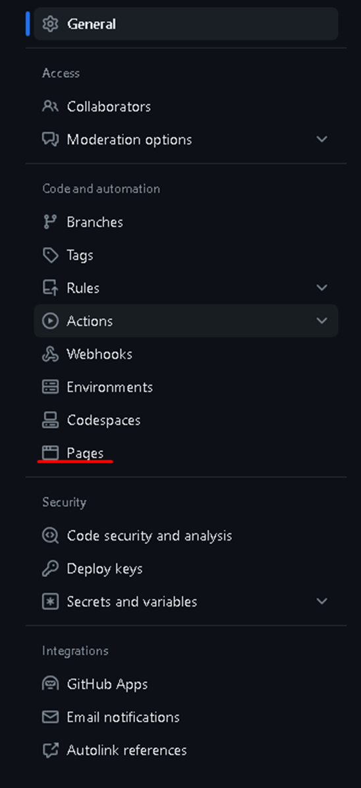

Una vez ya en Pages, asegurarnos que en Branch este seleccionado el de main y luego darle en save, esperamos unos minutos para que cargue la página.

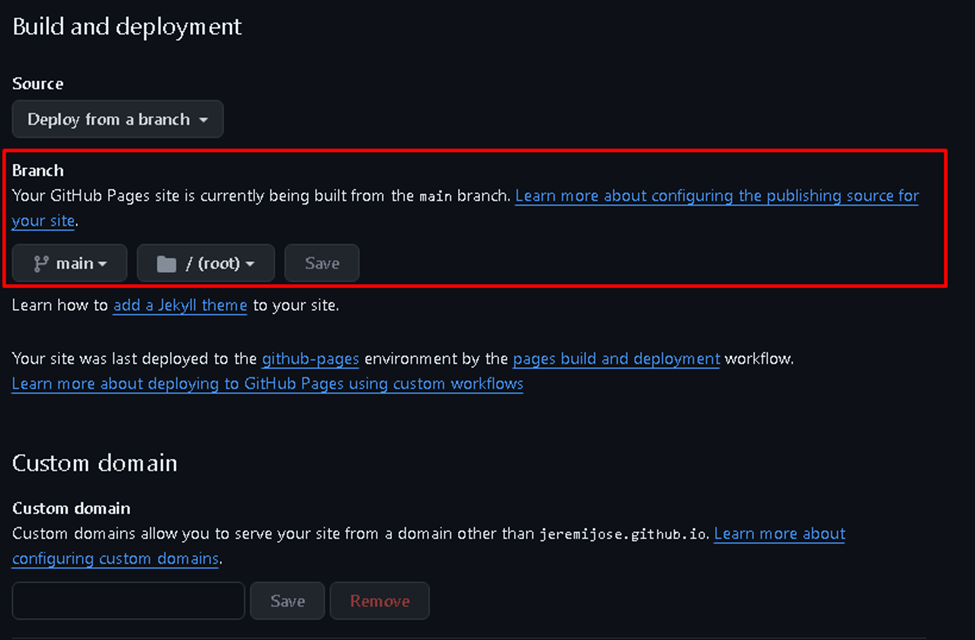

Luego de esperar cierto tiempo, esperamos a que nuestra página este subida a GitHub Pages, si sale para visitar nuestro sitio web es porque lo hicimos correctamente.

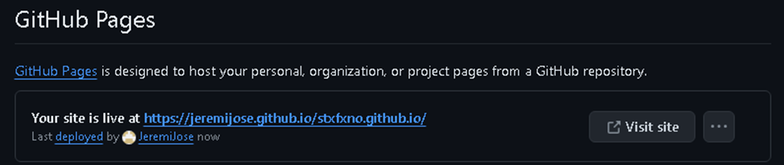
<h2>5.2 Product Implementation & Deployment</h2>
<h3>5.2.1.1 Sprint Planning 1</h3>
 <table>
            <thead>
                <tr>
                    <td>Sprint #</td>
                    <td>Sprint 1</td>
                </tr>
                <tr>
                    <td colspan="2">Sprint Planning Background</td>
                </tr>
            </thead>
            <tbody>
                <tr>
                    <td>Date</td>
                    <td>10/04/2024</td>
                </tr>
                <tr>
                    <td>Time</td>
                    <td>00:00 am</td>
                </tr>
                <tr>
                    <td>Location</td>
                    <td>Google Meet</td>
                </tr>
                <tr>
                    <td>Prepared By</td>
                    <td>Godofredo Quispe Tipo</td>
                </tr>
                <tr>
                    <td>Attendees (to planning meeting)</td>
                    <td>/ / Quispe Tipo, Godofredo /</td>
                </tr>
                <tr>
                    <td>Sprint n – 1 Review Summary</td>
                    <td>Debido a que es el primer sprint, no hay reviews de un sprint anterior.</td>
                </tr>
                <tr>
                    <td>Sprint n – 1 Retrospective Summary</td>
                    <td>Siendo el primer sprint, se mencionará la expectativa de los miembros del equipo: Terminar las actividades antes de la crítica. </td>
                </tr>
                <tr>
                    <td colspan="2">Sprint Goal & User Stories</td>
                </tr>
                <tr>
                    <td>Sprint 1 Goal</td>
                    <td>Diseñar e implementar una landing page, realizar el CRUD de adquisicion de boletos u entradas.</td>
                </tr>
                <tr>
                    <td>Sprint 1 Velocity</td>
                    <td>0</td>
                </tr>
                <tr>
                    <td>Sum of Story Points</td>
                    <td>13</td>
                </tr>
            </tbody>
        </table>

<h3>5.2.1.2 Sprint Backlog 1</h3>

En este primer Sprint Backlog el grupo se enfoco en realizar la landing page y el diseño del Front de la aplicación web junto con el CRUD de la venta de boletas. Para el registro de cada tarea utilizamos Trello

<table>
            <thead>
                    <tr>
                    <td>Sprint #:</td>
                    <td colspan="7">Sprint 1</td>
                    </tr>
                    <tr>
                        <td colspan="2">User Story</td>
                        <td colspan="6">Work-Item / Task</td>
                    </tr>
                    <tr>
                        <td>ID</td>
                        <td>Title</td>
                        <td>ID</td>
                        <td>Title</td>
                        <td>Description</td>
                        <td>Estimation (Hours)</td>
                        <td>Assigned to</td>
                        <td>Status (To-Do/In-Process/To-Review/Done)</td>
                    </tr>
            </thead>
            <tbody>
                    <tr>
                        <td>..</td>
                        <td>..</td>
                        <td>..</td>
                        <td>..</td>
                        <td>..</td>
                        <td>..</td>
                        <td>..</td>
                        <td>..</td>
                    </tr>
            </tbody>
</table>
<h3>5.2.1.3 Development Evidence for Sprint Review.</h3>
<table>
    <thead>
      <tr>
        <th>Repository</th>
        <th>Branch</th>
        <th>Commit ID</th>
        <th>Commit Message</th>
        <th>Commit Message Body</th>
        <th>Committed on (date)</th>
      </tr>
    </thead>
    <tbody>
      <tr>
        <td>ponlo para poder mostraralo en GitHub(URL)</td>
        <td>nombre_de_la_rama</td>
        <td>ID_del_commit</td>
        <td>Mensaje_del_commit</td>
        <td>Cuerpo_del_mensaje_del_commit</td>
        <td>Fecha_de_commit</td>
      </tr>
      <!-- Aquí puedes agregar más filas si necesitas -->
    </tbody>
</table>
<h3>5.2.1.4 Testing Suite Evidence for Sprint Review.</h3>
<table>
    <thead>
      <tr>
        <th>Repository</th>
        <th>Branch</th>
        <th>Commit ID</th>
        <th>Commit Message</th>
        <th>Commit Message Body</th>
        <th>Committed on (date)</th>
      </tr>
    </thead>
    <tbody>
      <tr>
        <td>ponlo para poder mostraralo en GitHub(URL)</td>
        <td>nombre_de_la_rama</td>
        <td>ID_del_commit</td>
        <td>Mensaje_del_commit</td>
        <td>Cuerpo_del_mensaje_del_commit</td>
        <td>Fecha_de_commit</td>
      </tr>
      <!-- Aquí puedes agregar más filas si necesitas -->
    </tbody>
</table>
<h3>5.2.1.5 Execution Evidence for Sprint Review.</h3>
Registro de usuario:

Ingreso de usuario:

Ingreso de fecha de publicacion del evento:

Añadiendo evento:

Descripcion del Evento:

Registro de Evento Confirmado:

<h3>5.2.1.6 Services Documentation Evidence for Sprint Review.</h3>

Para este primer sprint no fue contemplada la evidencia de documentacion de los servicios.

<h3>5.2.1.7 Software Deployment Evidence for Sprint Review.</h3>

<h3>5.2.1.8 Team Collaboration Insights during Sprint.</h3>
